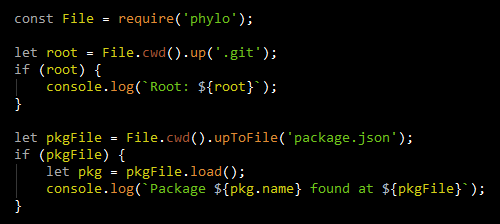

# phylo

Phylo (pronounced "File-o") is a File operations class designed for maximum
convenience and clarity of expression. The primary export of `phylo` is the
`File` class which is used to wrap a file-system path string.

Consider some examples:

The `root` value is determined by looking for a directory with a `'.git'` file or
folder in it, starting at `cwd` and climbing up as necessary. When that location is
found, it is returned as a `File` object. Note, this is not the `'.git'` folder
itself, but the folder that _contains_ the `'.git'` folder (that is, the VCS root).

The `pkgFile` value is determined in a similar manner but with two differences. The
first is that the location for which we are searching must contain a _file_ (not
a _folder_) with the name `'package.json'`. Secondly, it is the `'package.json'`
file that is returned as a `File` instance, not the location that contained it.

The `load()` method will read the file and parse the contents into an object (since
the file is type `'.json'`).

If you like infinite loops, you can try this on Windows:

    var path = require('path');
    
    for (var d = process.cwd(); d; d = path.resolve(d, '..')) {
        // climb up...
    }

This innocent loop works on Linux and Mac OS X because `path.resolve('/', '..')`
returns a falsy value. On Windows, however, `path.resolve('C:\\', '..')` returns...
well `'C:\\'`!

Compare the above to the same idea using `File`:

    for (var d = File.cwd(); d; d = d.parent) {
        // climb up...
    }

## Conventions

The `File` API strives to be purely consistent on these points:

 - Methods that take path parameters accept `String` or `File` instances.
 - Methods that end in `Path` return a `String`. Otherwise they return a `File`
  instance (when paths are involved).
 - Asynchronous methods are named with the "async" prefix and return a Promise.
 - Callbacks passed to async methods can return immediate results or Promises.
 - As much as possible, exceptions and `null` return values are avoided. For
  example, `stat()` returns an object in all cases but that object may have an
  `error` property.
 - Where reasonable, objects are cached to avoid GC pressure. For example, things
  like access masks, file attributes, status errors, directory list modes, etc. are
  lazily cached as immutable (`Object.freeze()` enforced) instances and reused as
  needed.

The conflict between Node.js `path` and `fs` API's is a major reason for these
naming conventions. Consider:

    let s = path.join(process.cwd(), 'foo');   // sync
    
    fs.mkdir(s);  // async!

Using `File`:

    let f = File.cwd().join('foo');   // sync (of course);
    
    f.mkdir();  // also sync

    f.asyncMkdir().then(...  // async obviously

It is intended that a `File` instance immutably describes a single path. What is
(or is not) on disk at that location can change of course, but the description is
constant.

## Path Manipulation

Much of the functionality provided by the `File` class is in the form of "lexical"
path manipulation. These are only provided in synchronous form since they operate on
path strings (like the `path` module).

### Properties

Instances of `File` provide these **readonly** properties:

 - `path` - The path to the file as a `String` (passed to the `constructor`).
 - `extent` - The file's type as a `String` (e.g., `'json'`).
 - `name` - The file's name as a `String` (e.g., `'package.json'`).
 - `parent` - The `File` for the parent directory (`null` at root).
 - `fspath` - The `path` string resolved for `'~'` (usable by `fs` or `path` modules)

### Methods

The methods that perform work on the path text and return `File` instances as a
result are:

 - `absolutify()` - Calls `path.resolve(this.path)`
 - `join()` - Joins all arguments using `path.join()`
 - `nativize()` - Make all separators native (`'\'` on Windows, `'/'` elsewhere)
 - `normalize()`- Calls `path.normalize(this.path)`
 - `relativize()`- Calls `path.relative()`
 - `resolve()`- Calls `path.resolve()` on all the arguments
 - `slashify()`- Make all separators `'/'` (Windows does understand them)
 - `terminate()` - Ensure there is a trailing separator
 - `unterminate()` - Ensure there is no trailing separator

To retrieve strings as a result, you can use these methods:

 - `absolutePath()` - Same as `absolutify` but returns a string
 - `joinPath()` - Same as `join` but returns a string
 - `nativePath()` - Same as `nativize` but returns a string
 - `normalizedPath()` - Same as `normalize` but returns a string
 - `relativePath()` - Same as `relativize` but returns a string
 - `resolvePath()` - Same as `resolve` but returns a string
 - `slashifiedPath()` - Same as `slashify` but returns a string
 - `terminatedPath()` - Same as `terminate` but returns a string
 - `unterminatedPath()` - Same as `unterminate` but returns a string

Some path operations perform I/O to the file-system and so provide both synchronous
and asynchronous versions.

 - `canonicalize()` - Calls `fs.realpathSync(this.path)` and returns a `File`
 - `canonicalPath()` - Same as `canonicalize` but returns a `String`

In asynchronous form:

 - `asyncCanonicalize()` - Same as `canonicalize` but Promises a `File`
 - `asyncCanonicalPath()` - Same as `asyncCanonicalize` but Promises a `String`

Canonicalization will result in `null` if there is no real file.

## Path Info and Comparison

Some useful information about a file path:

 - `isAbsolute()` - Returns `true` if the file an absolute path (`path.isAbsolute()`)
 - `isRelative()` - Returns `true` if the file a relative path (`path.isRelative()`)

You can compare two paths in a few different ways:

 - `compare(o,first)` - Returns -1, 0 or 1 if `this` is less-than, equal or
  greater-than `o`. By default, directories sort before files (first = `'d'`). To
  instead group files before directories, pass `'f'`. To compare only paths, pass
  `false`.
  in which case files sort before directories.
 - `equals(o)` - Returns `true` if `this` is equal to `o` (`compare(o) === 0`)
 - `prefixes(o)` - Returns `true` if `this` is a path prefix of `o`. It is
  recommended to use `absolutify()` on both instances first to avoid confusion with
  `..` segments.

There are some static sort methods that can be used by `Array.sort()`:

 - `File.sorter` - Calls `f1.compare(f2, 'd')` to group directories before files.
 - `File.sorterFilesFirst` - Calls `f1.compare(f2, 'f')` to group files first.
 - `File.sorterByPath` - Calls `f1.compare(f2, false)` to sort only by path.

File name comparisons are case-insensitive on Windows and Mac OS X, so we have

    var f1 = File.from('abc');
    var f2 = File.from('ABC');
    
    console.log(f1.equals(f2));
    
    > true   (on Windows and Mac)
    > false  (on Linux)

## File-System Information

To get information about the file on disk (synchronously):

 - `access()` - Returns a `File.Access` object. If the file does not exist (or some
  other error is encountered), this object will have an `error` property.
 - `can(mode)` - Returns `true` if this exists with the desired access (`mode` is `'r'`,
  `'rw'`, `'rwx'`, `'w'`, `'wx'` or `'x'`).
 - `exists()` - Returns `true` if the file exists.
 - `has(rel)` - Returns `true` if a file or folder exists at the `rel` path from this file.
 - `hasDir(rel)` - Returns `true` if a folder exists at the `rel` path from this file.
 - `hasFile(rel)` - Returns `true` if a file exists at the `rel` path from this file.
 - `isHidden()` - Returns `true` if this file does not exist or is hidden. Note that on
  Windows, hidden state is not based on a file name convention (".hidden") but is a bit
  stored in the file-system (see below).
 - `stat()` / `restat()` - Returns `fs.statSync(this.path)` (an `fs.Stats`). If the
  file does not exist (or some other error is encountered), this object will have an
  `error` property.
 - `statLink()` / `restatLink()` - Returns `fs.lstatSync(this.path)` (an `fs.Stats`). If
  the file does not exist (or some other error is encountered), this object will have an
  `error` property.

The `error` property will be a value like `'ENOENT'` (for file/folder not found), and
`'EACCES'` or `'EPERM'` for permission denied. These codes come directly from the
underlying API.

In asynchronous form:

 - `asyncAccess()` - Promises a `File.Access`
 - `asyncCan(mode)` - Promises `true` or `false`.
 - `asyncExists()` - Promises `true` or `false`.
 - `asyncHas(rel)` - TODO
 - `asyncHasDir(rel)` - TODO
 - `asyncHasFile(rel)` - TODO
 - `asyncIsHidden()` - Promises `true` or `false`
 - `asyncStat()` / `asyncRestat()` - Promises an `fs.Stats` via `fs.stat()`
 - `asyncStatLink()` / `asyncRestatLink()` - Promises an `fs.Stats` via `fs.lstat()`

### File Status

The [`fs.Stat`](https://nodejs.org/api/fs.html#fs_class_fs_stats) structure is augmented
with an `attrib` property. This is an instance of `File.Attribute` and will have these
boolean properties:

 - `A` - Archive
 - `C` - Compressed
 - `E` - Encrypted
 - `H` - Hidden
 - `O` - Offline
 - `R` - Readonly
 - `S` - System

For example:

    if (File.cwd().join('package.json').stat().attrib.H) {
        // If the package.json file is hidden... (wat?)
    }

Note, if there is no `'package.json'` file, the `stat()` method will return an object
with an `error` property and an empty `attrib` object (it won't have `H` set).

The [`fswin`](https://www.npmjs.com/package/fswin) module is used to retrieve this
information on Windows. On other platforms, this object contains `false` values for all
of the above properties.

An `fs.Stat` object is cached on the `File` instance by the `stat()` family of methods
and a separate instance is cached on by the `statLink()` family. These are lazily
retrieved and then stored for future use. To get fresh copies, use the `restat()` family
of methods.

### File.Access

`File.Access` objects are descriptors of read, write and execute permission masks.
These are much simpler to use than the `fs.constants.R_OK`, `fs.constants.W_OK` and
`fs.constants.X_OK` bit-masks. For example:

    try {
        let mode = fs.statSync(file).mode;
        
        if (mode & fs.constants.R_OK && mode & fs.constants.W_OK) {
            // file exists and is R and W
        }
    }
    catch (e) {
        // ignore... file does not exist
    }

Or using `File` and `File.Access`:

    if (file.access().rw) {
        // file exists and is R & W
    }

Alternatively, there is the `can()` method:

    if (file.can('rw')) {
        // file exists and is R & W
    }

When the file does not exist, or an error is encountered, the object returned by the
`access()` method will have an `error` property. Since the access bits are all `false`
in this case, this distinction if often unimportant (as above).

To check for errors:

    var acc = file.accecss();
    
    if (acc.rw) {
        // file exists and has R/W access
    }
    else if (acc.error === 'ENOENT') {
        // file does not exist...
    }
    else if (acc.error === 'EACCES' || acc.error === 'EPERM') {
        // access or permission error...
    }
    ...

There are a fixed set of immutable `File.Access` objects, one for each combination of
R, W and X permissions: `r`, `rw`, `rx`, `rwx`, `w`, `wx`, `x`. Each instance also has
these same properties as boolean values. The full set of properties is a bit larger:

 - `r` - True if `R_OK` is set.
 - `rw` - True if `R_OK` and `W_OK` are both set.
 - `rx` - True if `R_OK` and `X_OK` are both set.
 - `rwx` - True if `R_OK`, `W_OK` and `X_OK` are all set.
 - `w` - True if `W_OK` is set.
 - `wx` - True if `W_OK` and `X_OK` are both set.
 - `x` - True if `X_OK` is set.
 - `mask` - The combination of `fs.constants` flags `R_OK`, `W_OK` and/or `X_OK`
 - `name` - The string `'r'`, `'rw'`, `'rx'`, `'rwx'`, `'w'`, `'wx'` or `'x'`

### Classification

It is often important to know if a file is a directory or other type of entity. This
information is fundamentally the business of the `stat()` family but for convenience is
also provided on the `File` instance:

 - `isDirectory(mode)`
 - `isFile(mode)`
 - `isBlockDevice(mode)`
 - `isCharacterDevice(mode)`
 - `isFIFO(mode)`
 - `isSocket(mode)`
 - `isSymbolicLink(mode)`

In addition, the following shorthand methods are also available:

 - `isDir(mode)` (alias for `isDirectory()`)
 - `isSymLink(mode)` (alias for `isSymbolicLink()`)

These are also available as async methods:

 - `asyncIsDir(mode)`
 - `asyncIsDirectory(mode)`
 - `asyncIsFile(mode)`
 - `asyncIsBlockDevice(mode)`
 - `asyncIsCharacterDevice(mode)`
 - `asyncIsFIFO(mode)`
 - `asyncIsSocket(mode)`
 - `asyncIsSymLink(mode)`
 - `asyncIsSymbolicLink(mode)`

The optional `mode` parameter can be `'l'` (lowercase-L) to use the `statLink()` (or
`asyncStatLink()`) method to determine the result.

Since the nature of a file seldom changes on a whim, these methods use the `stat()`
methods and their cached information. If this is undesired, these results can be
refreshed using the `restat()` family of methods.

## Directory Listing

You can get a directory listing of `File` objects using:

 - `list(mode, matcher)`
 - `asyncList(mode, matcher)`

The `mode` parameter is a string that consists of the following single letter codes
with the described meaning:

 - `A` - All files are listed, even hidden files. (default is `false`)
 - `d` - List only directories. (default is `false`)
 - `f` - List only files (non-directories). (default is `false`)
 - `l` - Cache the result of `statLink` for each file. (default is `false`)
 - `o` - Order the items by `sorter`. (default is `true`)
 - `O` - Order the items by `sorterFilesFirst`. (default is `false`)
 - `s` - Cache the result of `stat` for each file. (default is `false`)
 - `w` - Indicates that Windows hidden flag alone determines hidden status
  (default is `false` so that files names starting with dots are hidden on all
  platforms).
 - `T` - Throw (or reject) on failure instead of returning (or resolving) `null`.

Some examples:

    // List non-hidden files/folders:
    dir.list();

    // lists all files/folders (including hidden):
    dir.list('A');

    // lists non-hidden files/folders and cache stat info:
    dir.list('s');

    // lists all files (no folders) and cache stat info:
    dir.list('Asf');

    // lists all files/folders and cache stat info but do not sort:
    dir.list('As-o');

The `s` option can be useful during an `asyncList()` operation to allow subsequent
use of the simpler, synchronous `stat()` method since it will use the cached stat
object.

The `matcher` can be a function to call for each candidate. This function receives
the arguments `(name, file)`. For example:

    dir.list(name => {
        return name.endsWith('.txt');
    });
    
    dir.list((name, f) => {
        return f.extent === 'txt';  // f is a File instance
    });

The `matcher` can also be a `RegExp`:

    dir.list(/\.txt$/i);

Lastly, `matcher` can be a "glob" (a shell-like wildcard). In this case, since this
is also a string, the `mode` must be passed first:

    dir.list('Af', '*.txt');

### Globs

The basic form of globs is a file name and extension pattern (like `'*.txt'`). The `'*'`
character matches only file name characters and not path separators (`'/'` and `'\'` on
Windows).

Internally globs are converted into `RegExp` objects. The conversion of `'*.txt'` is
platform-specific. For Linux, it is:

    /^[^/]*\.txt$/

On Windows, it converts to this:

    /^[^\\/]*\.txt$/i

This is because Windows uses either `'/'` and `'\'` as path separators and filenames
are case-insensitive.

To match paths, you can use a "glob star" such as `'**/*.txt'`. This glob converts to
this on Linux:

    /^(?:[^/]*(?:[/]|$))*[^/]*\.txt$/

Globs also support groups inside `'{'` and `'}'` such as: `'*.{txt,js}'`: 
 
    /^[^/]*\.(txt|js)$/

A character set like `'*.{txt,js}[abc]'` converts to:

    /^[^/]*\.(txt|js)[abc]$/

### Explicit Glob Conversion

The glob parser has some advanced options via the `File.glob()` method. The `File.glob()`
method converts a glob string into a `RegExp`. This conversion can be customized using
the second argument as the `options`. This string can contain any of these characters:

 - `C` - Case-sensitivity is manual (disables auto-detection by platform)
 - `G` - Greedy `'*'` expansion changes `'*'` to match path separators (i.e., `'/'`)
 - `S` - Simple pattern mode (disables grouping and character sets)

All other characters are passed as the `RegExp` flags (e.g., `'i'` and `'g'`).

The `'S'` options enables "simple" glob mode which disables groups and character sets.
For example:

    dir.list(File.glob('*.{txt,js}', 'S'));

    == /^[^/]*\.{txt\,js}$/

This would be useful when dealing with files that have `'{'` in their name.

To force case-sensitive comparison (e.g., on Windows):

    let re = File.glob('*.txt', 'C');

    /^[^\\/]*\.txt$/

To force case-insensitive comparison (e.g., on Linux), you need to use `'C'` to make
this a manual choice, and `'i'` to make the `RegExp` ignore case:

    let re = File.glob('*.txt', 'Ci');

    /^[^/]*\.txt$/i

## File-System Traversal

### Ascent

To climb the file-system to find a parent folder that passes a `test` function or
has a particular file or folder relatively locatable from there:

 - `up(test)` - Starting at this, climb until `test` passes.
 - `upDir(rel)` - Use `up()` with `hasDir(rel)` as the `test`.
 - `upFile(rel)` - Use `up()` with `hasFile(rel)` as the `test`.

To climb the file-system and find a relatively locatable item:

 - `upTo(rel)` - Starting at this, climb until `has(rel)` is `true` and then return
  `join(rel)` from that location.
 - `upToDir(rel)` - Same as `upTo()` but using `hasDir(rel)` as the `test`.
 - `upToFile(rel)` - Same as `upTo()` but using `hasFile(rel)` as the `test`.

The different between these forms can be seen best by example:

    var file = File.cwd().up('.git');
    
    // file is the parent directory that has '.git', not the '.git'
    // folder itself. The file may be File.cwd() or some parent.
    
    var git = File.cwd().upTo('.git');
    
    // git is the '.git' folder from perhaps File.cwd() or some other
    // parent folder.

Asynchronous forms (TODO - not implemented yet):

 - `asyncUp(test)` - TODO
 - `asyncUpDir(rel)` - TODO
 - `asyncUpFile(rel)` - TODO
 - `asyncUpTo(rel)` - TODO
 - `asyncUpToDir(rel)` - TODO
 - `asyncUpToFile(rel)` - TODO

### Descent

 - `tips(mode, test)` - Returns a `File[]` of the top-most items passing the `test`.
  Once a match is found, no descent into that folder is made (hence, the "tips" of
  the sub-tree). Uses `walk(mode)` to descend the file-system.
 - `walk(mode, matcher, before, after)` - Calls `before` for all items that
  `list(mode, matcher)` generates recursively, then processes those items and
  lastly calls `after`. Both `before` and `after` are optional but one
  should be provided.

The `walk` method's `before` and `after` handlers looks like this:

    function beforeOrAfter (file, state) {
        if (file.isDir() && ...) {
            return false;  // do not recurse into file (before only)
        }
        
        if (...) {
            state.stop = true;  // stop all further walking
        }
    }

The optional `matcher` can be a `String` or a `RegExp` and have the same meaning
as with `list()`. The `matcher` cannot, however, be a function. This is because it
would be ambiguous with `before` and would really offer no advantage over handling
things in the `before` method anyway.

The `state` object has the following members:

 - `at` - The current `File` being processed.
 - `root` - The `File` used to start the descent.
 - `stack` - A `File[]` of instances starting with the `File` used to start things.
 - `stop` - A boolean property that can be set to `true` to abort the `walk`.
 
The `tips` method's `test` looks like this:

    function test (file, state) {
        if (file.hasFile('package.json')) {
            return true; // file is a tip so gather it up and don't descend
        }
        
        return false; // keep going and/or descending
    }

The `state` parameter is the same as for the `walk` method.
 
Asynchronous forms:

 - `asyncTips(mode, test)`
 - `asyncWalk(mode, matcher, before, after)`

The `test`, `before` and `after` handlers of the asynchronous methods
accept the same parameters and return the same results as with the
synchronous forms. They can, alternatively, return a Promise if their
determination is also async.

## Reading and Writing Files

Basic file reading and decoding/parsing are provided by these methods:

 - `asyncLoad(options)` - Same as `load()` except a Promise is returned.
 - `load(options)` - Reads, decodes and parses the file according to 
  the provided `options`.

And serializing, encoding and writing is provided by:

 - `asyncSave(data, options)` - Same as `save()` except a Promise is
  returned.
 - `save(data, options)` - Serializes and encodes the data and writes
  it to this file using the specified `options`.

The act of loading a file consists initially of reading the data (obviously). To
get this part right, you need an `encoding` option which is tedious to setup in
the `fs` API, especially if the file name holds the clues you need.

Compare:

    var pkg = path.join(dir, 'package.json');

    var data = JSON.parse(fs.readfileSync(pkg, 'utf8'));

To loading using `File`:

    var pkg = dir.join('package.json');

    var data = pkg.load();

The basic advantage of the `File` approach is the error messages you get when
things go wrong. Using the first snippet you would get errors like these (based
on the parser used):

    Unexpected number in JSON at position 427

Using `load()` the message would be:

    Cannot parse ~/code/package.json: Unexpected number in JSON at position 427

With `File` there is hope in tracking down what has gone wrong.

When it is time to save the data, the process looks very symmetric:

    pkg.save(data);

Instead of the manual alternative:

    fs.writeFileSync(pkg, JSON.stringify(data, null, '    '), 'utf8');

**NOTE:** Unlike most of the `File` API, these methods throw exceptions (or reject
Promises) on failure.

### Predefined Readers

Readers are objects that manage options for reading and parsing files. The following
readers come predefined:

 - `bin` - An alias for `binary`.
 - `binary` - Reads a file as a buffer.
 - `json` - Extends the `text` reader and provides a `parse` method to
  deserialize JSON data. This uses the [`json5`](https://www.npmjs.com/package/json5)
  module to tolerate human friendly JSON.
 - `json:strict` - Extends `text` reader and uses strict `JSON.parse()`.
 - `text` - Reads a file as `utf8` encoding.
 - `txt` - An alias for `text`.

### Predefined Writers

Writers are objects that manage options for serializing and writing files. The
following writers come predefined:

 - `bin` - An alias for `binary`.
 - `binary` - Writes a file from a buffer.
 - `json` - Extends the `text` writer and provides a `serialize` method to
  write JSON data.
 - `json5` - Extends `json` writer and uses `json5.stringify()`.
 - `text` - Writes a file as `utf8` encoding. Accepts a `join` string option to
  join the data if the data is an array (of lines perhaps).
 - `txt` - An alias for `text`.

### Reader Options

The default reader is selected based on the file's type, but we can override this:
    
    var data = pkg.load('text'); // load as a simple text (not parsed)
    
Other options can be specified (e.g. to split by new-line):
    
    var data = pkg.load({
        type: 'text',
        split: /\n/g
    });

Readers support the following configuration properties:

 - `parse` - A function called to parse the file content. The method accepts two
  arguments: `data` and `reader`. The `data` parameter is the file's content and
  the `reader` is the fully configured `reader` instance.
 - `split` - An optional `RegExp` or `String` for a call to `String.split()`. This
  is used by the default `parse` method.

In addition to `reader` configuration, the `fs.readFile()` options can be supplied:

    var content = file.load({
        // The options object is passed directly to fs.readFile()
        options: {
            ...
        }
    });

The `encoding` can be specified in the `options` or directly to the `reader`:

    var content = file.load({
        encoding: 'utf16'
    });

    // Or on the fs options:
    
    var content = file.load({
        options: {
            encoding: 'utf16'
        }
    });

### Writer Options

The default writer is selected based on the file's type, but we can override this:
    
    pkg.save(data, 'text');
    
Other options can be specified (e.g. to join lines in an array with new-lines):
    
    pkg.save(data, {
        type: 'text',
        join: '\n'
    });

Writers support the following configuration properties:

 - `serialize` - A function called to convert the data and return what will be written
  to disk. The method accepts two arguments: `data` and `writer`. The `data` parameter
  is the raw file data and the `writer` is the fully configured `writer` instance.
 - `join` - An optional `String` for a call to `Array.join()` when file data is
  an array. This is used by the default `serialize` method.

The `json` writer also supports these properties:

 - `indent` maps to the `space` parameter for `JSON.stringify`.
 - `replacer` map to the `replacer` parameter for `JSON.stringify`.

In addition to `writer` configuration, the `fs.writeFile()` options can be supplied:

    file.save(data, {
        // The options object is passed directly to fs.writeFile()
        options: {
            ...
        }
    });

The `encoding` can be specified in the `options` or directly to the `writer`:

    file.save(data, {
        encoding: 'utf16'
    });

    // Or on the fs options:
    
    file.save(data, {
        options: {
            encoding: 'utf16'
        }
    });

## Removing Files and Folders

To remove a file or empty folder, you can use `remove()`:

    file.remove();

Internally, `remove()` calls either `fs.unlinkSync()` or `fs.rmdirSync()`.

A folder tree can be removed by passing the `'r'` option:

    dir.remove('r');

This will synchronously remove all children of `dir` and then remove `dir` itself.
Internally, this is handled by [`rimraf`](https://www.npmjs.com/package/rimraf).

The asynchronous form of `remove()` is:

    dir.asyncRemove().then(() => {
        // dir is gone if it was empty
    });

Or:

    dir.asyncRemove('r').then(() => {
        // dir and its children are gone
    });

## Static Methods

The most useful static methods are for conversion.

    var file = File.from(dir);

Regardless if the value of `dir` above is a `String` or `File`, `file` is a `File`
instance. If `dir` is `null` or `''` then `file` will be `null`.

In reverse:

    var s = File.path(file);

The `path()` method accepts `String` or `File` and returns the path (the original
string or the `path` property of the `File`). Similar to `from()`, the `path()` method
returns `''` when passed `null`. That value is still falsy but won't throw null
reference errors if used.

There is also `fspath()` that resolves `'~'` path elements:

    var s = File.fspath(file);

If the argument is already a `String` it is simply returned (just like the `path()`
method). If the string may contain `'~'` elements, the safe conversion would be:

    var s = File.from(file).fspath;

### Utility Methods

 - `access(fs)` - Returns a `FileAccess` for the `File` or `String`.
 - `exists(fs)` - Returns true if the `File` or `String` exists.
 - `isDir(fs)` - Returns true if the `File` or `String` is an existing directory.
 - `isFile(fs)` - Returns true if the `File` or `String` is an existing file.
 - `join(fs...)` - Return `path.join()` on the `File` or `String` args as a `File`.
 - `joinPath(fs...)` - Return `path.join()` on the `File` or `String` args as a `String`.
 - `resolve(fs...)` - Return `path.resolve()` on the `File` or `String` args as a `File`.
 - `resolvePath(fs...)` - Return `path.resolve()` on the `File` or `String` args as a `String`.
 - `split(fs)`- Returns a `String[]` from the `File` or `String`.
 - `stat(fs)` - Returns the `stat()` for the `File` or `String`.
 - `sorter(fs1, fs2)` - Calls `File.from(fs1).compare(fs2)` (useful for sorting
  `File[]` and `String[]`).

There are no asynchronous forms of these utility methods since they wouldn't really
save much:

Since this is not provided:

    File.asyncExists(file).then(exists => {
        ...
    });

Instead just do this:

    File.from(file).asyncExists().then(exists => {
        ...
    });

## Locating Special Folders

 - `cwd()` - Wraps `process.cwd()` as a `File`.
 - `home()` - Wraps `os.homedir()` as a `File`.
 - `profile()` - Returns the platform-favored storage folder for app data.
 - `temp()` / `asyncTemp()` - Temporary folder for this application.
 - `which(name,opts)` - Searches the **PATH** for a program by name. The `opts` can be
  a replacement **PATH** or an object with a `path` property that is the replacement.
  The asynchronous form is `asyncWhich(name,opts)`.

### Temp

The `temp()` and `asyncTemp()` static methods use the [`tmp`](https://www.npmjs.com/package/tmp)
module to generate a temporary folder in the appropriate location for the platform.

When these methods are called with no `options` argument, they lazily
create (and cache for future requests) a single temporary folder.

### Profile

The `profile()` method handles the various OS preferences for storing application
data.

 - Windows: `C:\Users\Name\AppData\Roaming\Company`
 - Mac OS X: `/Users/Name/Library/Application Support/Company`
 - Linux: `/home/name/.local/share/data/company`
 - Default: `/home/name/.company`

The "Company" part can be passed as the argument to `profile()` but is better left to
the top-level application to set `File.COMPANY`.

    File.COMPANY = 'Acme';

Now all libraries that use `phylo` will automatically store their profile data in the
proper folder for the user-facing application. In such a scenario it would be wise to
use the module name in the filename to ensure no collisions occur.

### The Magic Tilde

A common pseudo-root folder for the user's home folder is `'~'`. One often sees
paths like this:

    var dir = new File('~/.acme');

The `'~'` pseudo-root is recognized throughout `File` methods. It is resolved to the
actual location using `absolutify()` or `canonicalize()` (or their other flavors). In
other cases the pseudo-root is preserved. For example:

    var dir = new File('~/.acme');
    
    console.log(dir.parent); // just '~'
    console.log(dir.join('foo'));  // ~/acme/foo

These `File` instances can be read using `load()` as well:

    var data = File.from('~/.acme/settings.json').load();

In addition there is also the `'~~/'` pseudo-root that maps the the `profile()` directory
instead of the raw homedir.

That is:

    File.COMPANY = 'Acme';

    console.log(File.from('~/foo').absolutePath());
    console.log(File.from('~~/foo').absolutePath());

    // Windows:
    > C:\Users\MyName\foo
    > C:\Users\MyName\AppData\Roaming\Acme\foo

    // Mac OS X:
    > /Users/MyName/foo
    > /Users/MyName/Library/Application Support/foo

## Creating Directories

You can create a directory structure using the `mkdir()` method (or `asyncMkdir()`).
These methods create as many directory levels as needed to create the path described
by the `File` instance.

    var dir = File.from('~~/foo').mkdir();

The `mkdir()` method returns the `File` instance after creating the directory tree.

Unlike many other `File` methods, if `mkdir()` fails it will throw an `Error`.

---
`</technical>`

`<opinion>`
## Synchronous vs Asynchronous

There is considerable discussion regarding "when" or even, "if" it is acceptable to use
synchronous API's when developing for Node.js. As is often the case, it is easier to
ask the inverse question and "back in" to the answer we seek:
 
<blockquote><i>
When is it <b>unacceptable</b> to use synchronous API's?
</i></blockquote>

The reason synchronous API's get a bad rap is because they block the Node.js "event
loop". The event loop is the core dispatcher that allows all the normal, asynchronous
things to get their chance to execute. If some synchronous chunk of code is hogging
the single thread provided by Node, no asynchronously delivered callbacks can be
dispatched.

So the question becomes:

<blockquote><i>
What asynchronous callbacks will this synchronous code block?
</i></blockquote>

And that is really The Question here. If you are writing a server, probably the
most important callbacks would be those of the server module!

However, if you are writing a command-line tool, there is really no code running in
the background unless you initiated it. Which means there is really no harm in making
synchronous calls in this case.

But some would put the question on its head and ask instead:

<blockquote><i>
If asynchronous code is always OK, why not stick with it in all cases?
</i></blockquote>

If there were no costs associated with purely asynchronous code vs the synchronous
work-a-like, maybe that approach would make sense. Developers experienced with the
complexity of asynchronous code should take heart and some relief with a good quote:

<blockquote>
"A foolish consistency is the hobgoblin of little minds, 
adored by little statesmen and philosophers and divines"

-- Emerson [Self-Reliance](http://www.emersoncentral.com/selfreliance.htm)
</blockquote>

The upcoming `async` and `await` language features will greatly improve this situation,
but even with them, asynchronous code will be more complex then the synchronous
equivalent.

So, if you are providing a library (like `phylo`), then what? Since a library author
cannot know if their library will be used in a server context or a command-line tool,
such libraries (as with Node's own `fs` module) provide both forms.

When using `phylo`, it is best to understand your own context and decide if your life
would be simpler, easier and more productive by using synchronous API's.

If your context does not prevent it, they are certainly the way to go!

Enjoy!

Copyright (c) 2016 [Donald Griffin](https://github.com/dongryphon)
